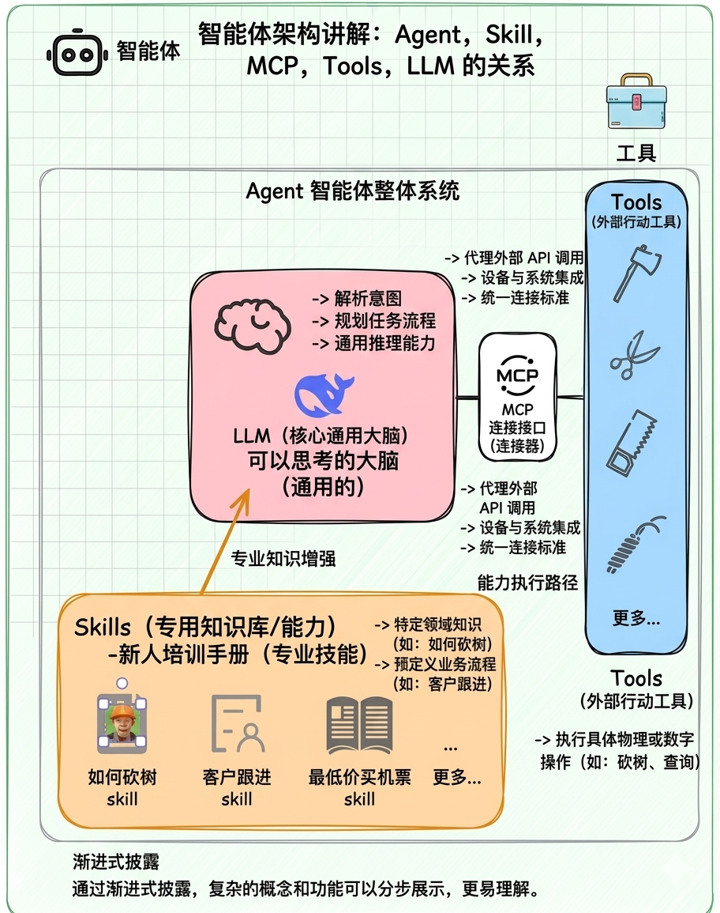
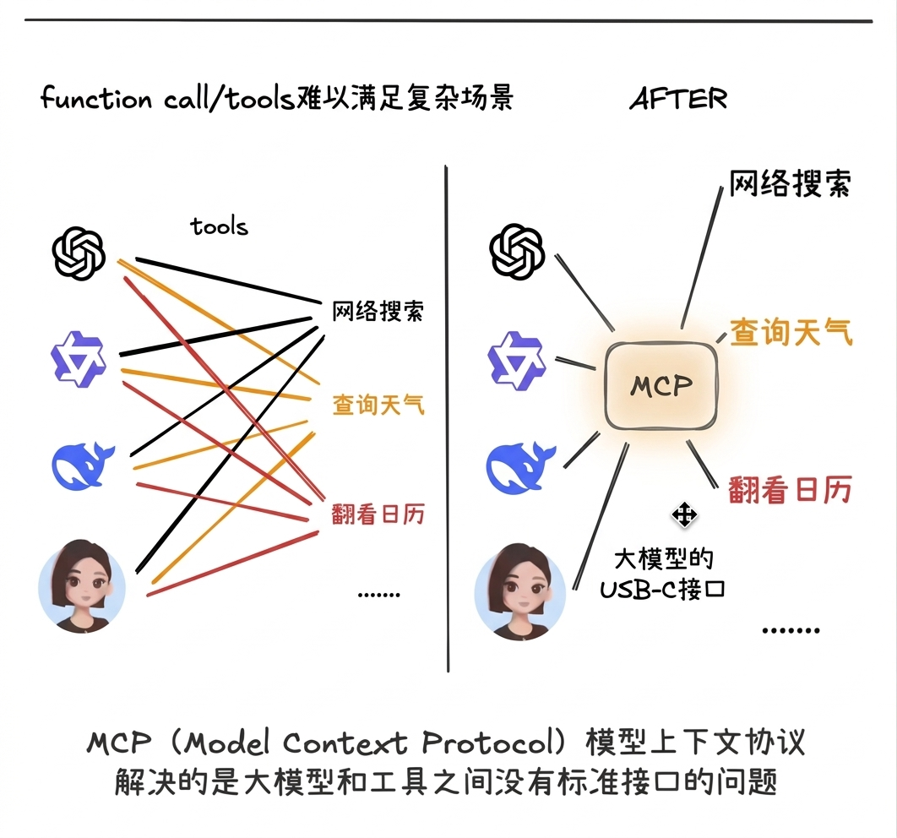

# 从 LLM 到 Agent Skill：底层逻辑完全指南

> 📌 通俗易懂的概念解析，帮你打通 AI 智能体的任督二脉

> 📺 **参考视频**：[一个视频了解 agent 什么是 agent？什么是 mcp？什么是 tools？什么是 skills？](https://b23.tv/o2qWoPt) - Bilibili

---

## 一、核心概念速览

| 概念 | 定义 | 角色 | 例子 |
|------|------|------|------|
| **LLM** | Large Language Model（大语言模型） | 大脑 | GPT-4、Claude、Qwen |
| **Agent** | LLM + 工具 + 记忆 + 自主性 | 完整的人 | OpenClaw、AutoGPT |
| **Skill** | 封装好的工具/能力包 | 手脚 | weather-skill、browser-skill |
| **MCP** | Model Context Protocol（模型上下文协议） | 协议标准 | MCP Server 规范 |

---

## 二、LLM：能思考但不能行动

**LLM = 读过全世界书籍的超级学霸**

### 1. 能做什么
- 写文章、回答问题、翻译、写代码、总结

### 2. 不能做什么
- ❌ 访问实时信息（不知道今天的天气）
- ❌ 操作外部工具（不能帮你发邮件）
- ❌ 执行代码（写的代码需要人来运行）

> 🎭 **比喻**：LLM 就像一个被关在房间里的智者，知识渊博但不能出门、不能用手机。

---

## 三、Agent：LLM 的完全体

**Agent = LLM + 工具 + 记忆 + 自主性**

```
┌─────────────────────────────────────────┐
│              Agent (智能体)              │
├─────────────────────────────────────────┤
│  🧠 大脑：LLM（理解和决策）              │
│  🛠️ 双手：Tools（执行能力）              │
│  📝 记忆：Memory（短期 + 长期记忆）       │
│  🔄 循环：感知 → 思考 → 行动 → 反馈      │
└─────────────────────────────────────────┘
```

**Agent 能做什么（LLM 做不到的）**：
- 查实时信息、操作工具、执行代码、多步任务、长期记忆

> 🦸 **比喻**：Agent = 智慧 + 战衣（工具）+ 基地（记忆）+ 任务（目标）

---

## 四、Skill：即插即用的能力包

**Skill = 封装好的工具/能力包**

| Skill 名称 | 功能 | 使用场景 |
|-----------|------|---------|
| `weather` | 查天气 | 用户问天气时自动调用 |
| `web_search` | 搜索网络 | 需要实时信息时调用 |
| `browser` | 控制浏览器 | 需要操作网页时调用 |

> 🎮 **比喻**：Skill 就像游戏里的技能书，捡到《火球术》→ 学会放火球，捡到 `weather` Skill → 学会查天气。

---

## 五、MCP：统一接口标准

**MCP = Model Context Protocol（模型上下文协议）**

把 MCP 想象成 **USB-C 接口标准**：

- 🔌 之前：每个工具都有自己的接口，适配成本高
- 📦 之后：所有工具统一接口，即插即用

### 1. MCP 核心概念

| 概念 | 说明 | 例子 |
|------|------|------|
| **MCP Host** | 运行 MCP 客户端的程序 | OpenClaw、Claude Desktop |
| **MCP Server** | 提供数据/工具的服务 | 天气 MCP Server、文件系统 MCP Server |
| **Resources** | 只读数据源 | 文件内容、数据库记录 |
| **Tools** | 可执行的操作 | 发送邮件、创建文件 |

### 2. MCP vs Skill

**一句话**：MCP 是协议标准，Skill 是具体实现

- **MCP** = USB-C 接口规范（统一标准）
- **Skill** = 具体的 USB 设备（U 盘、充电器）

### 3. MCP vs Function Calling

- **Function Calling** = 打电话的动作（怎么调用）
- **MCP** = 电话网络协议（怎么找到并连接）

---

## 六、四者关系总结

> **LLM 是大脑，Skill 是手脚，Agent 是完整的人**

```
用户 → Agent（决策中枢）→ Skills（天气/搜索/邮件）→ LLM（理解/生成）
```

| 概念 | 角色 | 能做什么 | 不能做什么 |
|------|------|---------|-----------|
| **LLM** | 大脑 | 理解、推理、生成文本 | 不能执行、不能记忆 |
| **Skill** | 手脚 | 执行具体任务 | 不能自主决策 |
| **Agent** | 完整的人 | 感知→思考→行动→反馈 | 受限于配置的 Skills |

**记忆口诀**：
- 🧠 **LLM 动脑不动手**
- 🔧 **Skill 动手不动脑**
- 🤖 **Agent 动脑又动手**

---

## 七、架构图解

### 1. Agent 架构图



> Agent 的核心组成：LLM 提供智能决策，Skills 封装能力知识，MCP 提供标准化接口，Tools 执行具体操作。

### 2. MCP 模型上下文协议



> MCP（Model Context Protocol）是连接 AI 与外部服务的统一协议标准，实现即插即用的工具生态。

---

## 八、延伸阅读

### 参考视频
- [一个视频了解 agent 什么是 agent？什么是 mcp？什么是 tools？什么是 skills？](https://b23.tv/o2qWoPt) - Bilibili
- [一口气拆穿 Skill/MCP/RAG/Agent/OpenClaw 底层逻辑](https://b23.tv/video/BV1ojfDBSEPv) - Bilibili

### 文档资源
- OpenClaw 中文文档：https://docs.openclaw.ai/zh-CN
- MCP 官方规范：https://modelcontextprotocol.io

### 实用工具
- [Nuwa Skill](https://github.com/alchaincyf/nuwa-skill) - 蒸馏任何人说话风格的 Skill，可自定义乔布斯、罗永浩、张雪峰等风格

---

*📌 本文档由 OpenClaw 小钉 生成 | 最后更新：2026-03-24*