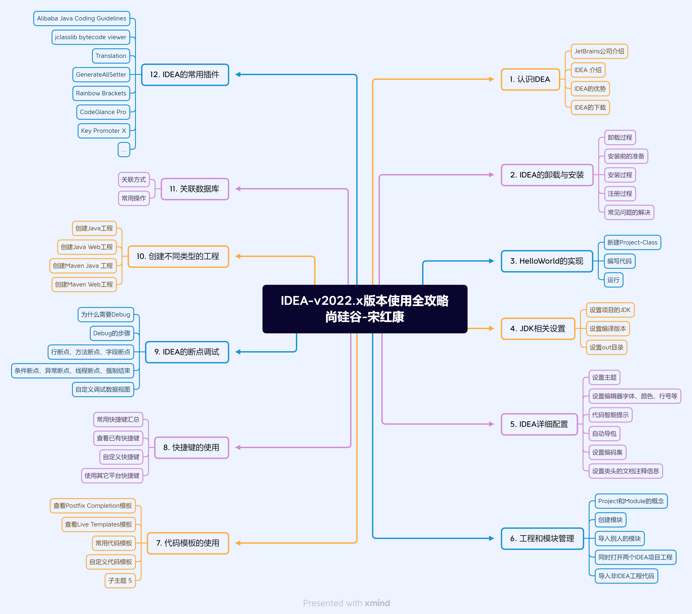

> 说明：本章内容为博主在原教程基础上添加自己的学习笔记，来源<http://es6.ruanyifeng.com/>，教程版权归原作者所有。
# IntelliJ IDEA 培训课件

## 目录

[TOC]
## 一、配套PDF资料
以下为本课程的配套PDF学习资料，可直接点击下载：

### 1.1 核心教程资料
- [尚硅谷_宋红康_Java开发利器：IDEA的安装与使用（上）](../../.vuepress/public/idea_assert/尚硅谷_宋红康_Java开发利器：IDEA的安装与使用（上）.pdf)
- [尚硅谷_宋红康_Java开发利器：IDEA的安装与使用（下）](../../.vuepress/public/idea_assert/尚硅谷_宋红康_Java开发利器：IDEA的安装与使用（下）.pdf)

### 1.2 快捷键参考
- [尚硅谷_宋红康_IntelliJ IDEA 常用快捷键一览表](../../.vuepress/public/idea_assert/尚硅谷_宋红康_IntelliJ0IDEA_常用快捷键一览表.pdf)

### 1.3 版本使用指南
- 

> ⚠️ **注意**：以上PDF文件均位于同一目录下，点击链接即可直接访问下载。

> **版权声明**：本课件基于尚硅谷宋红康老师的教学内容整理，仅供学习交流使用。
