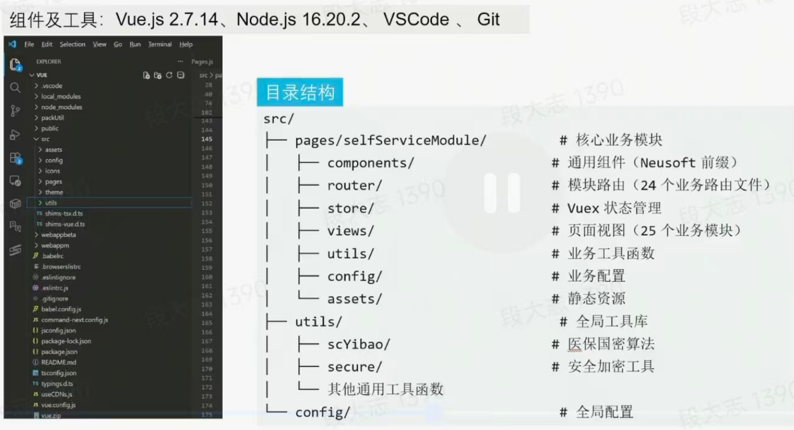

# Vue3+Vit+TypeScript

1. [尚硅谷 Vue3 Vite TS](https://gitee.com/marina-37/vue3_vite_ts)、
2. [es6-ruanyifeng](https://es6.ruanyifeng.com/#README)
3. [TypeScript-dselegent](https://dselegent-blog.netlify.app/front_end/js_advanced/typescript/01.html)、[TypeScript-runoob](https://www.runoob.com/typescript/ts-tutorial.html)
4. [BEM css开发规范](https://zhuanlan.zhihu.com/p/122214519)、[Sass首选CSS扩展语言](https://sass.bootcss.com/)
5. [构建工具vitejs4](https://vitejs.cn/vite5-cn)、行业标准webpack
6. [微前端qiankun](https://qiankun.umijs.org/zh)、
7. [vue状态管理pinia](https://pinia.vuejs.org/zh/introduction.html)
8. vue项目目录 

